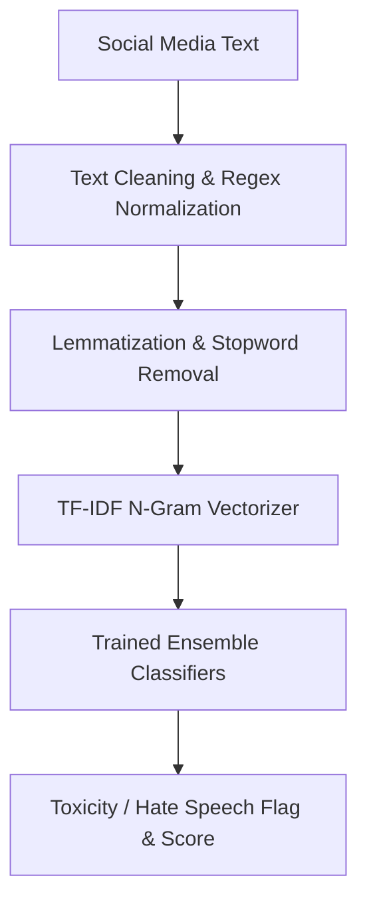

<div align="center">

# 🛡️ NLP Hate Speech & Toxicity Detection

<p align="center">
  <strong>Machine Learning & Natural Language Processing Content Moderation Engine</strong>
</p>

<p align="center">
     
</p>

<p align="center">
  <a href="#-overview">Overview</a> •
  <a href="#-system-architecture">Architecture</a> •
  <a href="#-key-features--capabilities">Key Features</a> •
  <a href="#-tech-stack--tools">Tech Stack</a> •
  <a href="#-quick-start">Quick Start</a> •
  <a href="#-author--license">Author</a>
</p>

</div>

---

## 📌 Overview

An automated NLP content moderation framework capable of flagging hate speech, toxicity, harassment, and abusive comments in online community discussions.

---

## 🏗️ System Architecture



---

## ✨ Key Features & Capabilities

- 🧹 **Robust Text Cleaning**: Regex emoji extraction, slang expansion, and lemmatization.
- 📊 **Multi-Model Benchmark**: Evaluated SVM, Random Forest, Multinomial Naive Bayes, and Logistic Regression.
- ⚡ **High-Throughput Scoring**: Low latency inference suitable for live streaming chat moderation.
- 🚀 **Deployable Microservice**: Ready-to-use REST API endpoints.

---

## 🛠️ Tech Stack & Tools

- **Python**
- **Scikit-Learn**
- **NLTK**
- **FastAPI / Flask**
- **Pandas**
- **Seaborn**

---

## 🚀 Quick Start

### 📋 Prerequisites
Ensure you have the required runtime environment installed:
* **Git** version 2.30+
* **Python 3.9+** / **Node.js 18+** / **Android Studio** (depending on project stack)

### 📥 Installation & Setup

```bash
# 1. Clone the repository
git clone https://github.com/muhammadokashapak/Hate-Speech-Detection.git

# 2. Enter the directory
cd Hate-Speech-Detection
```

---

## 👨‍💻 Author & License

<div align="center">

**Muhammad Okasha**
<br/>
*Deep Learning & Mobile Software Engineer*
<br/><br/>
<a href="https://github.com/muhammadokashapak"></a>
<a href="https://linkedin.com/in/muhammad-okasha"></a>
<a href="mailto:muhammadokashapak@gmail.com"></a>

<br/><br/>

*⭐️ If you find this project helpful, please consider giving it a star! • © 2026 [Muhammad Okasha](https://github.com/muhammadokashapak)*

</div>
